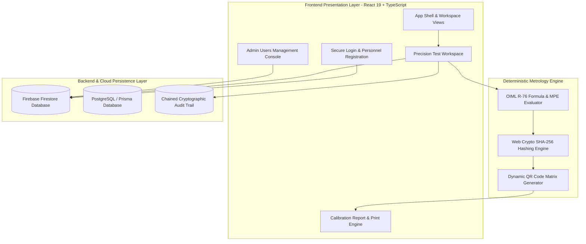

<div align="center">

# ⚖️ Mapan (मापन)
### Legal Metrology Operating System & OIML R-76 Automated Verification Platform

[](https://www.sih.gov.in/)
[](#-problem-statement)
[](#-team-codesmiths)
[](#-oiml-r-76-standard-compliance)

*An enterprise-grade, cloud-connected digital operating system for testing, verification, and tamper-evident certificate generation of Non-Automatic Weighing Instruments (NAWI) in strict compliance with OIML Recommendation R-76 and ISO/IEC 17025.*

---

</div>

## 📌 Problem Statement

- **Hackathon**: Smart India Hackathon (SIH) 2026
- **Problem Statement ID**: `26035`
- **Problem Statement Title**: *Development of a Software Program/Application for Generation of Test Reports for Non-Automatic Weighing Instruments (NAWI) as per OIML Recommendation R-76*
- **Theme**: Miscellaneous
- **Category**: Software
- **Team Name**: **CodeSmiths**

---

## 🚨 The Problem & Real-World Need

Traditional legal metrology verification across laboratories, mandis, and commercial centers currently relies on manual testing, fragmented Excel spreadsheets, and physical paper certificates. This leads to critical systemic vulnerabilities:

1. **Human Mathematical Errors**: Manual calculation of step-function Maximum Permissible Error (MPE) thresholds across accuracy classes ($e$, $n = \text{Max}/e$) is error-prone.
2. **Fraud & Economic Losses**: Fraudulent weighing practices and lack of digital traceability cause severe under-reporting of farmers' produce in agricultural mandis and commercial transactions (*Hindustan Times, Times of India*).
3. **Counterfeit & Altered Certificates**: Paper certificates lack cryptographic integrity and can be easily forged or modified without detection.
4. **No Centralized Traceability**: Siloed, non-standardized regional inspection formats result in missing mandatory periodic calibration, re-stamping deadlines, and unverified commercial scales.

---

## 💡 The Solution: Mapan (Legal Metrology OS)

**Mapan** provides a unified, end-to-end digital verification ecosystem that automates mathematical calculations, enforces legal metrology standards, cryptographically seals test certificates, and establishes a national searchable registry.


---

## 🌟 Key Innovations & Features

### 1. ⚙️ Automated OIML R-76 Formula Engine
- Automatically computes intrinsic errors ($E = I - L$) and multi-tier step-function Maximum Permissible Error (MPE) curves across **Accuracy Classes I, II, III, and IIII**.
- Real-time client-side validation triggers immediate alerts if a reading exceeds allowable tolerance bands.

### 2. 📜 Gazette-Compliant Standardized Legal Certificates
- Generates official, publication-grade **Legal Metrology Verification & Calibration Certificates** conforming to OIML R 76-1:2006 (E) and ISO/IEC 17025.
- Includes comprehensive instrument identification ($Max$, $Min$, $e$, $d$, $n$), ambient conditions ($T$, $RH$, $P$), reference standard traceability, observation table, tolerance deviation ratio, and conformity decisions.

### 3. 🔐 Cryptographic SHA-256 Digital Sealing
- Every generated certificate is stamped with a live **SHA-256 cryptographic digest** computed over canonical verification parameters. Any tampering immediately invalidates the seal.

### 4. 📱 Dynamic Scannable QR Code Verification
- Certificates embed live, scannable QR codes. Field enforcement officers and consumers can scan the certificate with any smartphone camera to instantly verify certificate authenticity, serial number, test date, and pass status.

### 5. 🛡️ Immutable Digital Audit Trail
- Cryptographically chained, timestamped event logging tracks every login, instrument registration, observation entry, certificate seal, and administrative modification.

### 6. 👥 Role-Based Access Control (RBAC)
- **Laboratory Supervisor (Admin)**: Full CRUD super-powers across instruments, test records, certificates, audit trails, system rules, and the **Personnel Users Console** (invite, edit roles, activate/deactivate personnel).
- **Testing Metrologist (Operator)**: Authorized to register instruments, run calibration sessions, record observations, and seal verified certificates while personal account security is self-managed.

### 7. ☁️ Real-time Cloud Synchronization
- Seamless bi-directional cloud synchronization powered by **Firebase Firestore** and **PostgreSQL/Prisma** with robust offline-first caching.

---

## 🏗️ Technical Architecture & Approach



---

## 📊 OIML R-76 Standard Compliance

| Accuracy Class | Verification Interval ($e$) | Number of Intervals ($n = \text{Max}/e$) | Initial Verification MPE Range |
| :--- | :--- | :--- | :--- |
| **Class I (Special)** | $0.001\text{ g} \le e$ | $50,000 \le n$ | $\pm 0.5e$ ($0 \le m \le 50,000e$)<br>$\pm 1.0e$ ($50,000e < m \le 200,000e$)<br>$\pm 1.5e$ ($m > 200,000e$) |
| **Class II (High)** | $0.001\text{ g} \le e \le 0.05\text{ g}$<br>$0.1\text{ g} \le e$ | $100 \le n \le 100,000$<br>$5,000 \le n \le 100,000$ | $\pm 0.5e$ ($0 \le m \le 5,000e$)<br>$\pm 1.0e$ ($5,000e < m \le 20,000e$)<br>$\pm 1.5e$ ($m > 20,000e$) |
| **Class III (Medium)** | $0.1\text{ g} \le e \le 2\text{ g}$<br>$5\text{ g} \le e$ | $100 \le n \le 10,000$<br>$500 \le n \le 10,000$ | $\pm 0.5e$ ($0 \le m \le 500e$)<br>$\pm 1.0e$ ($500e < m \le 2,000e$)<br>$\pm 1.5e$ ($m > 2,000e$) |
| **Class IIII (Ordinary)** | $5\text{ g} \le e$ | $100 \le n \le 1,000$ | $\pm 0.5e$ ($0 \le m \le 50e$)<br>$\pm 1.0e$ ($50e < m \le 200e$)<br>$\pm 1.5e$ ($m > 200e$) |

---

## 📈 Impact, Benefits & Feasibility

```
┌───────────────────────────┬───────────────────────────┬───────────────────────────┐
│     TECHNICAL FEASIBILITY │      ECONOMIC VIABILITY   │   OPERATIONAL EXCELLENCE  │
├───────────────────────────┼───────────────────────────┼───────────────────────────┤
│ • Proven Web Standards    │ • Eliminates Paper Waste  │ • Intuitive Lab Interface │
│ • Deterministic Formulas  │ • Reduces Manual Overhead │ • Real-Time Error Alerts  │
│ • Secure Cryptography     │ • Prevents Revenue Loss   │ • 1-Click PDF Generation  │
│ • Cloud Scalability       │ • Saves Testing Resources │ • Centralized Repository  │
└───────────────────────────┴───────────────────────────┴───────────────────────────┘
```

- **Accuracy**: Eliminates mathematical calculation mistakes by executing unit-tested OIML algorithms directly against raw inputs.
- **Efficiency**: Cuts testing turnaround times from hours to minutes per instrument.
- **Productivity**: Produces publication-grade PDF certificates with print-isolated styles (`@media print`) on demand.
- **Transparency**: Gives enforcement officers and consumers instantaneous verification via QR code and SHA-256 hash checks.

---

## 💻 Tech Stack

### Frontend
- **React 19** & **TypeScript** (Strict mode & type safety)
- **Vite** (Next-generation high-speed bundler)
- **Vanilla CSS Design System** (Custom tokens, glassmorphism, responsive grid)
- **Lucide React** (Clean modern iconography)
- **QRCode Engine** (Vector/Canvas live scannable QR generation)
- **Web Crypto API** (Native browser SHA-256 digest computation)

### Backend & Cloud
- **Node.js** & **Express**
- **Firebase Firestore** (Real-time cloud database & authentication)
- **Prisma ORM** & **PostgreSQL** (Relational schemas & audit logging)
- **Puppeteer & PDFKit** (Server-side PDF rendering & seal generation)

---

## 👥 Team CodeSmiths

- **Hackathon**: Smart India Hackathon (SIH) 2026
- **Problem Statement ID**: 26035
- **Project**: Mapan (Legal Metrology OS)

---
